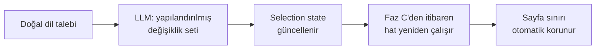

# Bölüm V/2 — Pipeline Faz D-G (21-25)

> AtomCV spec · [INDEX](../INDEX.md) · bu dosya yalnız aşağıdaki bölümleri içerir.

---

## 21. Faz D — Yeniden Yazım

### 21.1 Adım 1 — Alternatiflerden seçim (LLM'siz)

```java
Optional<AtomVariant> pickExisting(Atom atom, String targetLang, String tone) {
    return atom.variants().stream()
        .filter(v -> v.language().equals(targetLang))
        .filter(v -> tone == null || tone.equals(v.tone()))
        .max(comparingDouble(v -> similarity(v.embedding(), jdVector)));
}
```

Uygun varyant varsa **maliyet sıfır** — kullanıcının profil editöründe yaptığı yatırım burada karşılık buluyor.

### 21.2 Adım 2 — Üç kademeli müdahale eşiği

| Skor | Müdahale | Gerekçe |
|---|---|---|
| **≥ 0.65** | Tam uyarlama: keyword entegrasyonu + terminoloji hizalama | Gerçek bağlantı var, vurgulamak dürüst |
| **0.40 – 0.65** | Sadece sıkıştırma (uzunsa) | Alakalı ama zorlamaya değmez |
| **< 0.40** | **Hiç dokunma** | Bağlantı yok; uyarlama = uydurma |

**Ek bütçe kısıtı:** en yüksek skorlu ilk **6-8 atom** uyarlanır. Bu hem maliyeti sınırlar hem "her cümlesi keyword dolu" yapay CV'yi önler.

`verbatim = true` atomlar bu aşamaya **hiç gönderilmez**.

### 21.3 Uzunluk kısıtı — sayfa garantisinin korunması

Faz C atomları **ölçülmüş maliyetleriyle** seçti. Faz D metni uzatırsa sayfa taşar.

```java
int maxChars = (int)(original.plainText().length() * 1.05);   // %5 tolerans
```

Prompt'ta belirtilir **ve kodda doğrulanır**.

### 21.4 Prompt

```
Bu tek bir CV maddesi. İş ilanına daha uygun hale getir.

MADDE: {original.plainText}
BU MADDENİN GERÇEK BECERİLERİ: {atom.skills}
İLANIN ARADIĞI: {jd.requiredSkills}
KORUNMASI ZORUNLU: {atom.metrics}, {atom.properNouns}
MAKSİMUM UZUNLUK: {maxChars} karakter
TON: {preferences.tone}
DİL: {targetLanguage}

KURALLAR:
- Yalnızca "BU MADDENİN GERÇEK BECERİLERİ" listesindeki teknolojilerden bahsedebilirsin
- İlanın aradığı bir beceri bu listede YOKSA, ondan BAHSETME
- Tüm sayıları ve özel isimleri aynen koru
- Maddenin anlamını değiştirme, sadece ifadeyi ilana yakınlaştır
- Klişe ifadeler kullanma
```

`atom.skills`'i prompt'a vermek kritik — LLM'in "neyi iddia edebileceğinin" sınırını çiziyor.

### 21.5 Paralel yürütme (Virtual Threads)

```java
try (var scope = new StructuredTaskScope.ShutdownOnFailure()) {
    var tasks = candidates.stream()
        .map(atom -> scope.fork(() -> rewriteOne(atom, ctx)))
        .toList();
    scope.join().throwIfFailed();
    return Result.ok(RewrittenContent.of(tasks.stream().map(Subtask::get).toList()));
} catch (Exception e) {
    // Yeniden yazım tamamen başarısızsa: orijinallerle devam et, üretimi DÜŞÜRME
    return Result.ok(RewrittenContent.fallbackToOriginals(state));
}
```

### 21.6 Doğrulama katmanı

```java
public ValidationResult validate(RichContent original, String rewritten, Atom atom) {
    var issues = new ArrayList<Issue>();

    // 1. Sayı korunumu
    for (String metric : atom.metrics())
        if (!containsNormalized(rewritten, metric)) issues.add(NUMBER_LOST(metric));

    // 2. Özel isim korunumu
    for (String noun : atom.properNouns())
        if (!rewritten.contains(noun)) issues.add(PROPER_NOUN_LOST(noun));

    // 3. Desteklenmeyen iddia — EN KRİTİK
    for (String tech : extractTechnologies(rewritten))
        if (!atom.skills().contains(canonicalize(tech))) issues.add(UNSUPPORTED_CLAIM(tech));

    // 4. Uzunluk
    if (rewritten.length() > maxChars) issues.add(TOO_LONG);

    // 5. Anlamsal kayma
    if (cosineSimilarity(embed(rewritten), atom.embedding()) < 0.80) issues.add(SEMANTIC_DRIFT);

    return new ValidationResult(issues);
}
```

**Başarısızlık davranışı:**
```
1. deneme başarısız → tekrar dene (farklı seed/sıcaklık)
2. deneme başarısız → ORİJİNAL METNİ KULLAN
```

Sistem asla doğrulanmamış içerik yayınlamaz. `UNSUPPORTED_CLAIM` için **sıfır tolerans**.

### 21.7 About sentezi

About tek atom değil, birden fazla atomdan sentezleniyor:

```
Girdi:  seçilmiş atomların skills + metrics birleşimi + JD odağı + self_description
Kısıt:  ~65 kelime (ölçülmüş bütçe)
Kural:  Yalnızca girdideki becerilerden ve metriklerden bahset
        Kişilik özelliği yalnızca self_description'da varsa kullanılabilir
```

Doğrulama: About'ta geçen her teknoloji, seçilmiş atomların `skills` birleşiminde olmalı.

### 21.8 Dil yönetimi

```
1. Hedef dilde varyant var mı?  → varsa kullan (maliyet 0)
2. Yoksa: kaynak varyanttan çevir + ilana göre uyarla (tek çağrı)
3. Çıktıyı yeni varyant olarak KAYDET (created_by='llm_translate')
4. Doğrulama: sayılar/özel isimler korundu mu? (dil değişse de sabit kalmalı)
```

**Çeviri önbelleği:** İkinci üretimde aynı dil isteniyorsa varyant zaten var → maliyet sıfır.

---

## 22. Faz E — Render

### 22.1 Katmanlı yapı

```
RichContent (run modeli)
      ↓
InlineRenderer      → run → format-özel inline kod
      ↓
BlockRenderer       → atom/entry/section → blok yapısı
      ↓
DocumentRenderer    → preamble + bloklar + customization
      ├──► MeasurementDocument (\savebox + \typeout)
      └──► FinalDocument
```

### 22.2 Arayüzler

```java
public interface DocumentRenderer {
    String formatId();
    Set<String> supportedTemplates();
    RenderedSource renderFinal(RenderRequest req);
    RenderedSource renderMeasurement(MeasurementRequest req);
    CapacityModel capacity(TemplateCustomization c);
}

public record RenderRequest(
    ProfileHeader header,
    List<RenderableSection> sections,
    TemplateCustomization customization,
    Locale contentLanguage
) {}
```

**Dikkat:** `RenderRequest` içinde atom ID'si, skor, kilit bilgisi **yok**. Renderer seçim mantığını bilmez.

### 22.3 LaTeX inline renderer

```java
public class LatexInlineRenderer implements InlineRenderer {

    private static final Map<Character, String> ESCAPES = Map.ofEntries(
        entry('&', "\\&"), entry('%', "\\%"), entry('$', "\\$"),
        entry('#', "\\#"), entry('_', "\\_"), entry('{', "\\{"),
        entry('}', "\\}"), entry('~', "\\textasciitilde{}"),
        entry('^', "\\textasciicircum{}"), entry('\\', "\\textbackslash{}")
    );

    @Override
    public String render(RichContent content) {
        var sb = new StringBuilder();
        for (Run run : content.runs()) {
            String s = escape(run.text());
            for (String mark : run.marks()) {
                s = switch (mark) {
                    case "technology", "metric" -> "\\textbf{" + s + "}";
                    case "emphasis"             -> "\\textit{" + s + "}";
                    case "organization"         -> s;
                    case "link"                 -> "\\href{" + escapeUrl(run.href()) + "}{" + s + "}";
                    default                     -> s;    // ← ileri uyumluluk
                };
            }
            sb.append(s);
        }
        return sb.toString();
    }
}
```

**Escape merkezi ve tek yerde.** Önceki nesilde bu bir prompt kuralıydı; artık kod. LLM'in escape hatası yapması yapısal olarak imkânsız.

### 22.4 Ölçüm dokümanı

> **Not (Adım 1.4-1.5).** Aşağıdaki parçacık olduğu gibi derlenmiyor:
> `\mbox` zaten bir LaTeX komutu (kutunun adı `\measurebox` oldu), `itemize`
> içinde `\item` yok ("perhaps a missing \item" ile duruyor), ve kutu
> `\textwidth` yerine **`\linewidth`** genişliğinde ölçülmeli — madde işareti
> hiçbir zaman o genişliği görmez. Üçü de EK D.8.1 ve **EK D.8.3**'te.

```java
public RenderedSource renderMeasurement(MeasurementRequest req) {
    var sb = new StringBuilder();
    sb.append(preamble(req.customization()));      // ← FINAL İLE BİREBİR AYNI
    sb.append("\\begin{document}\n\\newsavebox{\\mbox}\n");

    for (MeasurableItem item : req.items()) {
        sb.append("\\begin{itemize}[leftmargin=0.15in,label={}]\n");
        sb.append("\\savebox{\\mbox}{\\parbox{\\measurewidth}{")
          .append(inlineRenderer.render(item.content()))
          .append("}}\n");
        sb.append("\\typeout{ATOMCOST|").append(item.key())
          .append("|\\the\\ht\\mbox|\\the\\dp\\mbox}\n");
        sb.append("\\end{itemize}\n");
    }
    sb.append("\\end{document}");
    return new RenderedSource(sb.toString());
}
```

**Üç şey birebir aynı olmalı** (yoksa ölçüm yalan söyler):
1. Preamble (font, boyut, margin, satır aralığı)
2. `\measurewidth` = final dokümandaki gerçek `\textwidth`
3. Sarmalayıcı ortam (`itemize` içinde basılıyorsa ölçüm de öyle)

`item.key()` = `{variantId}:{customizationId}:{templateVersion}`

### 22.5 Preamble üretimi

```java
private String preamble(TemplateCustomization c) {
    return """
        \\documentclass[letterpaper,%.0fpt]{article}
        \\usepackage{fontspec}
        \\setmainfont{%s}
        \\usepackage[margin=%.2fin]{geometry}
        \\linespread{%.2f}
        \\definecolor{accent}{HTML}{%s}
        \\newlength{\\measurewidth}\\setlength{\\measurewidth}{\\textwidth}
        %s
        """.formatted(
            c.fontSizePt(),
            FontRegistry.resolve(c.fontFamily()),   // enum → whitelist
            c.marginInches(),
            c.lineSpacing(),
            c.accentColor().hex(),                  // regex doğrulanmış
            TemplateRegistry.base(c.baseTemplateId())
        );
}
```

**Güvenlik:** Hiçbir kullanıcı stringi doğrudan LaTeX'e girmez. Font enum'dan, renk regex'ten, sayılar aralık kontrolünden geçer. Bölüm başlıkları `escape()` üzerinden.

### 22.6 HTML ve DOCX renderer'ları

Aynı `RichContent` girdisi, farklı çıktı:

```java
// HTML
case "technology", "metric" -> "<strong>" + htmlEscape(text) + "</strong>";

// DOCX (POI)
run.setBold(true); run.setText(text);
```

| Renderer | Kapasite birimi | Ölçüm yöntemi | Güvenlik payı |
|---|---|---|---|
| LaTeX | punto | `\savebox` + log | %2 |
| HTML→PDF | piksel | headless tarayıcı `getBoundingClientRect()` | %5 |
| DOCX | tahmini satır | font metriği (Word ölçümü alınamaz) | %12 |

DOCX'te sayfa garantisi **yaklaşıktır** — kullanıcıya belirtilir.

---

## 23. Faz F — Doğrulama

> **Not (Adım 1.7).** Aşağıdaki `pdfAnalyzer` diye bir bileşen yok: sayfa sayısı
> derleyiciden **`X-Page-Count` başlığıyla** geliyor ve gelmezse belge
> reddediliyor. 23.2 (ATS metin çıkarma) ve 23.3 (`FitReport`) Aşama 2'de.
> Uygulanan hali ve gerekçeleri: **EK D.8.6**.

### 23.1 Sayfa doğrulaması

```java
var pdf = latexCompiler.compile(source);
int actualPages = pdfAnalyzer.pageCount(pdf);

if (actualPages > options.maxPages()) {
    // LLM'e DÖNME. Bütçeyi kıs, Faz C'yi tekrarla.
    if (retryCount < 2) {
        return selectionPhase.execute(input.withBudgetFactor(0.95), ctx);
    }
    return Result.err(new PageLimitExceeded(actualPages, options.maxPages()));
}
```

Sapma oranı metrik olarak izlenir (`selection.budget.overshoot.rate`). Yükseliyorsa ölçüm katmanında sorun var.

### 23.2 ATS uyumluluk kontrolü

```java
public AtsReport checkAts(byte[] pdf) {
    String extracted = pdfTextStripper.extract(pdf);
    return new AtsReport(
        containsAllSectionHeaders(extracted),
        contactInfoParseable(extracted),
        textOrderCorrect(extracted),        // beklenen sırayla mı çıkıyor
        noTableArtifacts(extracted)
    );
}
```

### 23.3 Uygunluk raporu

**Yüzde gösterilmez** — sahte hassasiyet yaratır. Sayılabilir gerçekler gösterilir:

```java
public record FitReport(
    int requiredCovered, int requiredTotal,
    int preferredCovered, int preferredTotal,
    List<String> coveredSkills,
    List<String> missingRequired,
    List<String> missingPreferred,
    MatchLevel level
) {}

MatchLevel level(FitReport r) {
    if (r.requiredTotal() - r.requiredCovered() >= 2) return WEAK;
    if (r.requiredTotal() - r.requiredCovered() == 1) return MODERATE;
    if (preferredRatio(r) > 0.6)                      return STRONG;
    return GOOD;
}
```

**Kullanıcı gösterimi:**
```
İLAN ANALİZİ

Zorunlu beceriler       4/4  ✓
  Go · Kubernetes · mikroservis · PostgreSQL

Tercih edilen           2/3
  ✓ gRPC  ✓ CI/CD  ✗ Terraform

💡 Terraform deneyimin varsa profiline eklemen bu ilanla
   eşleşmeni güçlendirir

ℹ Bu analiz, CV'nin ilandaki terimleri ne kadar yansıttığını
  gösterir. Gerçek işe alım kararları deneyim derinliği,
  mülakat ve diğer adaylara göre değişir.
```

**Zayıf eşleşmede dürüst ama cesaret kırmayan mesaj:**
```
Eşleşme: Zayıf
İlandaki 4 zorunlu becerinin 1'i profilinde bulunuyor.
CV'n en alakalı içeriğinle dolduruldu.
Yine de başvurabilirsin — CV'n hazır.
```

---

## 24. Faz G — Düzenleme Döngüsü

### 24.1 Mimari kural

> **Düzenlemeler render edilmiş çıktı üzerinde değil, selection state üzerinde yapılır.**



### 24.2 Değişiklik seti

```json
{
  "aboutDirective": { "emphasis": "microservices" },
  "atomChanges": [
    { "atomId": "atm_proj_android", "action": "exclude" },
    { "atomId": "atm_proj_payment", "action": "include" },
    { "atomId": "atm_exp_2_b4", "action": "override", "text": "..." }
  ],
  "globalDirectives": { "tone": "more_concise" }
}
```

### 24.3 Neden bu kritik

Çıktı metni doğrudan düzenlenseydi:
- 3-4 düzenleme sonrası sayfa bütçesi bozulurdu
- Her düzenleme tam doküman LLM çağrısı gerektirirdi
- Sistem tutarsızlaşırdı

Selection state üzerinden gidilince kullanıcı **20 kere düzenleme yapsa bile** sayfa sınırı garantili kalır.

### 24.4 Manuel toggle'lar

Doğal dil dışında, kullanıcı doğrudan da müdahale edebilir:

```
POST /api/v1/generations/{id}/selection
{ "include": ["atm_..."], "exclude": ["atm_..."] }
```

Bu, `GenerationDirectives.includeAtoms/excludeAtoms` alanlarına yazılır ve Faz C'de kısıt olarak uygulanır.

### 24.5 Örtük sinyal takibi

```java
// Kullanıcı bir atomu elle dahil ettiyse → algoritma onu kaçırmış
telemetry.count("selection.manual_include", tags("atomScore", bucket(score)));
// Elle çıkardıysa → algoritma yanlış seçmiş
telemetry.count("selection.manual_exclude", tags("atomScore", bucket(score)));
```

**Metrik:** `manuel_düzenleme_oranı = düzenlenen_üretim / toplam_üretim`. %40 üzerindeyse seçim algoritması zayıf demektir.

Bu **öğrenen sistem değil** — geliştiricinin algoritmayı elle iyileştirmesi için gösterge.

---

## 25. Orkestratör, Result Tipi ve Hata Hiyerarşisi

### 25.1 Result tipi (Java 21 sealed interface)

```java
public sealed interface Result<T> permits Result.Ok, Result.Err {

    record Ok<T>(T value) implements Result<T> {}
    record Err<T>(PipelineError error) implements Result<T> {}

    static <T> Result<T> ok(T value) { return new Ok<>(value); }
    static <T> Result<T> err(PipelineError e) { return new Err<>(e); }

    default <R> Result<R> map(Function<T,R> fn) {
        return switch (this) {
            case Ok<T> o  -> Result.ok(fn.apply(o.value()));
            case Err<T> e -> Result.err(e.error());
        };
    }

    default <R> Result<R> flatMap(Function<T, Result<R>> fn) {
        return switch (this) {
            case Ok<T> o  -> fn.apply(o.value());
            case Err<T> e -> Result.err(e.error());
        };
    }

    default boolean isErr() { return this instanceof Err<T>; }
}
```

Kütüphaneye (Vavr) gerek yok — dilin kendisi yeterli.

### 25.2 Hata hiyerarşisi

> **Not (Aşama 1).** `PipelineError` yalnız hattın bugün üretebildiği dört
> durumu taşıyor: `InsufficientProfile`, `ConflictingPreferences`,
> `PageLimitExceeded`, `CompilationFailed`. Gerisi kendi fazlarıyla gelecek —
> erken eklemek `params` alanlarını tahmin etmek olurdu, ve frontend'in
> mesajlarının ihtiyacı tam olarak o alanlar (EK D.8.6, D.8.8).

```java
public sealed interface PipelineError {

    // ── Ön kontroller (LLM çağrısı yapılmadan) ──
    record InsufficientProfile(int completeness, List<String> missing) implements PipelineError {}
    record UnparseableJobDescription(double confidence, int skillsFound) implements PipelineError {}
    record ConflictingPreferences(double pinnedPt, double budgetPt, List<Resolution> options) implements PipelineError {}
    record FeatureRequiresAccount(String feature) implements PipelineError {}
    record QuotaExceeded(String metric, Instant resetsAt) implements PipelineError {}

    // ── Çalışma zamanı ──
    record AllProvidersUnavailable(List<String> tried) implements PipelineError {}
    record CompilationFailed(String detail, boolean rawSourceAvailable) implements PipelineError {}
    record PageLimitExceeded(int actual, int limit) implements PipelineError {}
    record RewriteValidationFailed(UUID atomId, List<String> issues) implements PipelineError {}
    record EmbeddingUnavailable() implements PipelineError {}
}
```

### 25.3 Hata sunumu — P4 prensibinin zorlanması

```java
@Component
public class ErrorPresenter {
    public UserFacingError present(PipelineError error) {
        return switch (error) {   // ← exhaustive switch: yeni hata tipi eklenince derlenmez
            case InsufficientProfile e -> new UserFacingError(
                "INSUFFICIENT_PROFILE",
                Map.of("completeness", e.completeness(), "missing", e.missing()),
                List.of(action("complete_profile"))
            );
            case ConflictingPreferences e -> new UserFacingError(
                "CONFLICTING_PREFERENCES",
                Map.of("pinnedPages", e.pinnedPt()/pageHeight, "maxPages", e.budgetPt()/pageHeight),
                e.options().stream().map(this::toAction).toList()
            );
            // ... her tip için ZORUNLU
        };
    }
}
```

Bu tasarım, "her hata tipi için mesaj + seçenek yazmadan kod derlenmez" garantisi veriyor.

### 25.4 Orkestratör

```java
@Service
public class GenerationOrchestrator {

    public Result<GenerationOutcome> run(GenerationRequest req, PipelineContext ctx) {

        // ── ÖN KONTROLLER (P5) ──
        var guard = preflightGuard.check(req, ctx);
        if (guard.isErr()) return propagate(guard);

        // ── FAZ A (koşullu) ──
        Result<JobAnalysis> analysis = req.hasJobDescription()
            ? jobAnalysisPhase.execute(req.jobDescription(), ctx)
            : Result.ok(JobAnalysis.generalMode());
        if (analysis.isErr()) return propagate(analysis);

        // ── FAZ B → C (iç döngü, LLM'siz) ──
        var selection = selectWithFitting(analysis.value(), ctx, 0);
        if (selection.isErr()) return propagate(selection);

        // ── FAZ D ──
        var rewritten = rewritePhase.execute(selection.value(), ctx);
        if (rewritten.isErr()) return propagate(rewritten);

        // ── FAZ E → F ──
        var rendered = renderPhase.execute(toRenderInput(rewritten.value(), ctx), ctx);
        var report   = verificationPhase.execute(rendered.value(), ctx);

        if (report.value().exceedsPageLimit() && ctx.retryCount() < 2) {
            return run(req, ctx.withBudgetFactor(0.95).incrementRetry());
        }

        return Result.ok(new GenerationOutcome(rendered.value(), report.value(), selection.value()));
    }
}
```

### 25.5 Ön kontrol kapısı (PreflightGuard)

```java
public Result<Void> check(GenerationRequest req, PipelineContext ctx) {
    // 1. Profil yeterliliği
    if (ctx.profile().completeness() < MIN_COMPLETENESS)
        return err(new InsufficientProfile(...));

    // 2. Yetenek kontrolü (anonim kısıtları)
    var capCheck = capabilities.validate(req.options(), ctx.capabilities());
    if (capCheck.isErr()) return capCheck;

    // 3. Kota
    if (!quotaService.tryConsume(ctx.subject(), "generation"))
        return err(new QuotaExceeded("generation", nextReset()));

    // 4. İlan ön kontrolü
    if (req.hasJobDescription()) {
        var jdCheck = jobDescriptionPrecheck.check(req.jobDescription());
        if (jdCheck.isErr()) return jdCheck;
    }

    // 5. Tercih çelişkisi (kilitli içerik bütçeyi aşıyor mu)
    var budgetCheck = budgetPrecheck.check(ctx);
    if (budgetCheck.isErr()) return budgetCheck;

    return ok();
}
```

**Tüm kontroller LLM çağrısından önce.** Bu, hem maliyet koruması hem UX.

---
